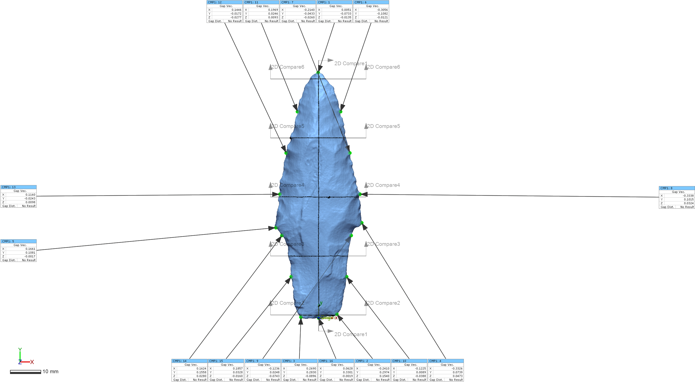
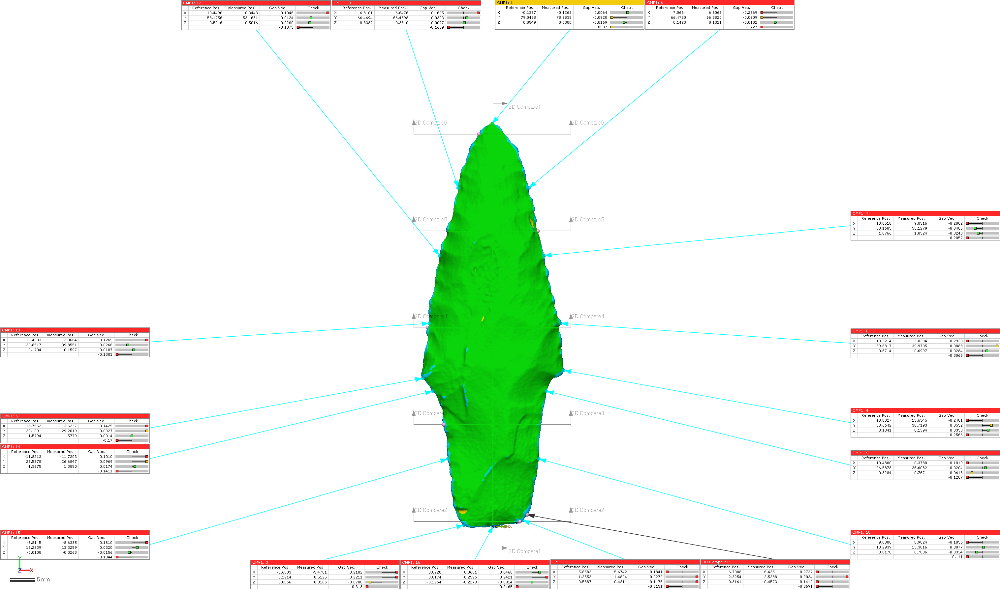

# Processing Matters: 3D Mesh Morphology

This systematic study demonstrates the variable impacts that processing decisions have upon 3D meshes.

The study leverages a batch protocol developed using Geomagic Design X and Control X to systematically evaluate processed meshes, with the goal of demonstrating the variation in mesh morphology introduced during the processing workflow.

The figure below illustrates a preliminary comparison of laser scan data collected and remeshed at different resolutions. These preliminary results indicate that 3D scan data collected and processed using identical protocols (best case scenario) differ most in high-curvature areas. The high-curvature areas of projetile points (edges) are representative of some of the most likely locations for landmarks and semilandmarks, given that they describe the general shape of the point in plan view. In addition to those scans processed in the scanner-specific software, additional processing protocols were enlisted using the Rvcg package.

MicroCT scan data were collected with a Bruker SkyScan, and laser scan data were collected using a NextEngineHD. All raw and processed data are open access, and will be made available for download at the conclusion of the analysis. 

### Acknowledgments

Thanks to the National Forests and Grasslands in Texas for the requisite access, permissions, and funding needed for data collection, to Adam Summers in the Friday Harbor Laboratory at the University of Washington for access to the microCT scanner, and to Jonathan M. Huie at the University of Washington for assisting with data collection.