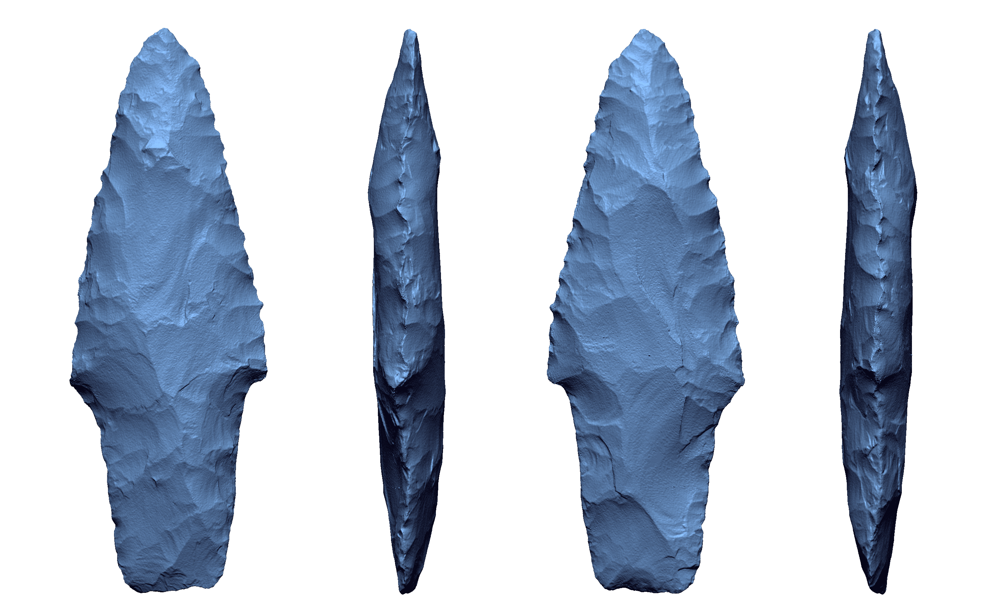

# Processing Matters: 3D Mesh Morphology

Substantive advancements have been made toward automating the application of landmarks and semilandmarks. These approaches can aid in expediting the landmarking process, while simultaneously reducing landmarking errors and investigator bias. This study enlists a template-based approach to quantify deviations in mesh processing outputs using a Pontchartrain dart point from the collections of the National Forests and Grasslands in Texas, which was scanned and processed at multiple resolutions using microCT, laser, and structured light scanners. Following data collection and output, meshes were processed using an automated and replicable workflow. A batch processing protocol was developed in Geomagic Design X and Control X to facilitate exploratory comparisons of the processed meshes, which indicated that the greatest changes to the meshes occurred along the lateral margins of the dart point. Results of the geometric morphometric study evince implications for processed meshes curated in digital repositories, making it clear that should investigators endeavor to incorporate curated meshes that they should begin with the unprocessed data, enlist uniform processing protocols across the sample, and comprehend the many vagaries of 3D data collection and processing across multiple modalities.

The study leverages a batch protocol developed using Geomagic Design X and Control X to systematically evaluate processed meshes, with the goal of demonstrating the variation in mesh morphology introduced during the processing workflow for a microCT and laser scanned dataset. The protocol includes a 3D compare, a series of 2D comparisons of cross-sections, as well as comparison points (not landmarks) placed at mathematically-defined locations (i.e., horizontal/vertical tangents, points of highest curvature, etc.).

A preliminary run of the protocol for laser scan data collected and remeshed at different resolutions was successful at identifying areas of deviation between the meshes. Those results, while preliminary, indicate that 3D scan data collected and processed using identical protocols (best case scenario) differ most in high-curvature areas. The high-curvature areas of projetile points (edges) represent some of the most likely locations for landmark and semilandmark placement, given that they describe the general shape of the point in plan view. Additional processing protocols were enlisted using the Rvcg package following export from the data collection software, and are followed by the application of a template-based landmark and semilandmark points at well-defined locations, and along the lateral margins.

MicroCT scan data were collected using a Bruker SkyScan, and laser scan data were collected with a NextEngineHD. Both the unprocessed and processed data will be made available in an open access format, where they can be downloaded at the conclusion of the analysis.

### Acknowledgments

Thanks to the National Forests and Grasslands in Texas for the requisite access, permissions, and funding for data collection (USFS grant 15-PA-11081300-033 to RZS), to Morgane Dubied at the MorphOptics Laboratory at CNRS for guidance with applying digit3DLand, to Adam Summers in the Friday Harbor Laboratory at the University of Washington for access to the microCT scanner, and to Jonathan M. Huie at the University of Washington for his assistance with microCT data collection.