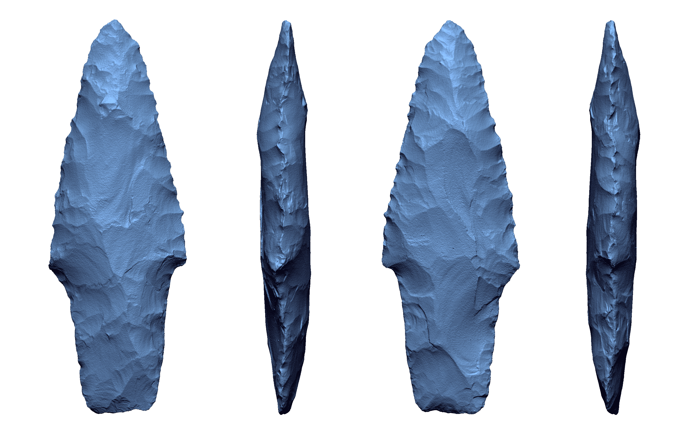
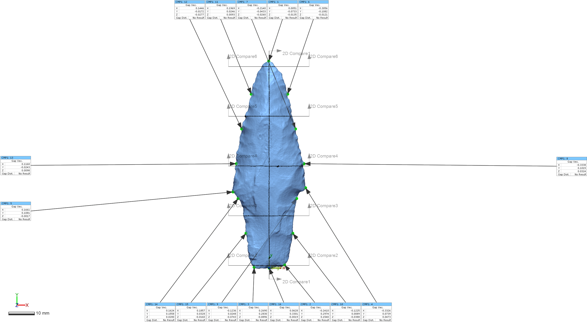

--- 
title: "Supplementary data for paper: Processing matters: 3D mesh morphology"
author: "Robert Z. Selden, Jr."
date: "`r Sys.Date()`"
site: bookdown::bookdown_site
documentclass: book
bibliography: [book.bib]
biblio-style: apalike
link-citations: yes
description: "Analysis of 3D meshes."
---

# Preliminaries {-}

Three dimensional scanning continues to permeate modern research in archaeology, and the NextEngine scanner is among the most ubiquitous in archaeologial and museum-based research. The NextEngine allows users to employ a wide range of processing algorithms to render the mesh that will be exported for use. In the published archaeological literature, those methods employed to process meshes are regularly omitted and seldom discussed. To illustrate variability in resolution alone, six scans---each at a different resolution---were collected for a single Pontchartrain projectile point, and each was remeshed, then exported at one of nine resolutions yielding a sample of 54 unique scans. A batch processing protocol was developed using _Geomagic Design X_ and _Geomagic Control X_ to facilitate exploratory comparisons of the processed meshes, which indicated that the greatest changes to those meshes occurred along the lateral margins of the dart point. Results of the study evince implications for processed meshes curated in digital repositories, making it clear that should investigators endeavour to incorporate curated meshes, that they should begin with the unprocessed data, enlist uniform processing protocols across the sample, and comprehend the vagaries of 3D data collection and processing within and across different modalities.

This study systematically evaluates 3D meshes collected with a NextEngine scanner, and processed (remeshed) at different resolutions, with the goal of demonstrating where variation occurs in the mesh morphology. The protocol includes a comparison of 3D meshes, a series of 2D comparisons of cross-sections, and deviations for comparison points placed at mathematically-defined locations (i.e., horizontal/vertical tangents, points of highest curvature, etc.).

The analysis identified those areas where the meshes differ. Those results indicate that 3D scan data collected and processed using identical protocols (best case scenario) differ most in high-curvature areas. The high-curvature areas of projectile points (lateral edges) are among the most likely locations for landmark and semilandmark placement, given their contribution to the description of the general shape of the point in plan view. 

### Acknowledgments

Thanks to the National Forests and Grasslands in Texas for the requisite access, permissions, and funding for data collection and analysis (15-PA-11081300-033).
